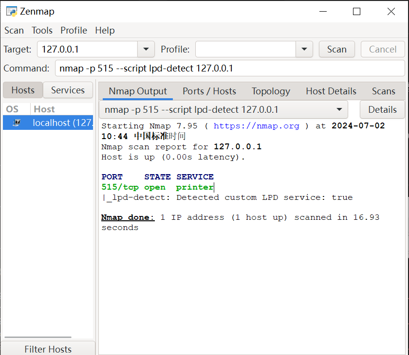

# LPD协议服务端模拟工具

本项目是一个使用 Go 实现的 LPD 控制协议模拟器。它模拟了一个 LPD 控制协议服务器，使您可以通过模拟服务器-客户端交互来测试扫描器或客户端工具。模拟器支持通过配置文件动态配置认证方法和 LPD 版本

## 功能介绍

- 模拟 LPD 控制协议服务器
- 通过命令行或配置文件进行配置
- 记录客户端交互日志（连接握手、身份验证等）
- 日志以 [LPD] 为前缀
- 支持各种扫描工具（例如 nmap、fofa）
- 通过配置文件动态配置 AUTH METHODS 和 VERSION
## nmap扫描效果展示


## 使用方法

### 1. 安装依赖
- 系统上需要安装 Go 1.16 及以上版本。
- 安装 logrus 和 yaml.v2 包。可以通过以下命令安装
```go
{
    go get github.com/sirupsen/logrus
    go get gopkg.in/yaml.v2
}
```
### 2. 对配置文件进行配置
```go
{
  "server_name": "lpd",
  "banner_message": "",
  "version": "1.0",
  "port": 515,
  "log_file_path": "lpd_server.log"
}

```
#### 参数说明
- server_name     服务器名称
- banner_message  响应信息配置
- version  版本配置
- port           端口配置
- log_file_path 日志路径配置
### 3.运行模拟器
```go 
go run main.go -config config.yaml
```


## 效果展示

模拟器运行后，将在指定端口监听传入连接。您可以使用各种工具和命令来测试模拟器。以下是一些示例交互：
### 打印机状态请
`0x02print_queue`
### 服务段响应：
`lpd [@Boyk]: Print-services are not available to your host (aF2qXkQ2m)`
### 模拟打印作业提交
`0x02`
### 服务段响应：
`%lpd [1.0]: Print job for queue line received\n`
### 打印队列列表请求
`0x03`
### 服务段响应：
`lpd [1.0]: Available queues: queue1, queue2, queue3`


## 日志
模拟器记录所有客户端交互。日志以 [LPD] 为前缀，并包含关于接收命令和发送响应的详细信息。日志将写入配置文件中指定的文件（例如示例中的 Lpd_server.log）
### 日志输出示例：
```
2024/07/02 10:40:24 [LPD] Connection from 127.0.0.1:28394
2024/07/02 10:40:24 [LPD] Received command: 0x02 print_queue from 127.0.0.1:28394
2024/07/02 10:40:24 [LPD] Sent custom status to 127.0.0.1:28394: lpd [@Boyk]: Print-services are not available to your host (aF2qXkQ2m).

2024/07/02 10:44:43 [LPD] Connection from 127.0.0.1:28579
2024/07/02 10:44:43 [LPD] Received command: 0x02 print_queue from 127.0.0.1:28579
2024/07/02 10:44:43 [LPD] Sent custom status to 127.0.0.1:28579: lpd [@Boyk]: Print-services are not available to your host (aF2qXkQ2m).

2024/07/02 11:06:50 [LPD] Server started on port 515
```
## 贡献
如果您发现任何问题或有改进建议，请随时提交问题或拉取请求。

## 作者
sunhanfei

